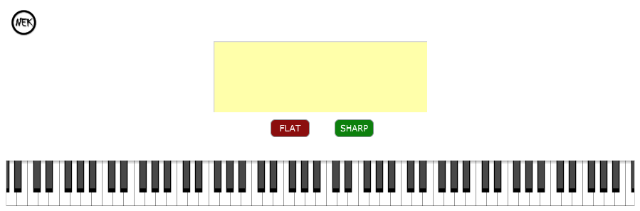

# NEK - A MIDI Chord Analyzer Plugin
NEK is an open source MIDI chord analyzer. It functions as a music educational software as well. NEK can work as a software app or VST plugin. It takes in MIDI notes and outputs a chord name. The algorithm has a database for intervals and what intervals make up the chords. By projecting notes into different pitch classes, it uses an elegant but subtle algorithm to deduce the note and get the appropriate chord. This is all the more remarkable as the database is extensible. Put in the intervals that make up your chord and you are good to go! NEK has also a Circle of Fourths/Fifths visualizer. This can make it useful to identify harmonic patterns while playing. Lastly, NEK comes with notation rendering functionality! As you press notes on the keyboard, they are highlighted on a Grand Stave according to the key you select. 

## Demo Video
You can check out a DEMO video of NEK on my LinkedIn page [here](https://www.linkedin.com/posts/chukwuemeka-nkama-0203611b2_recently-i-needed-a-chord-analyzer-plugin-activity-7230562767424917504-Ct0K).

## Todo
---
```
- Notation Rendering Capabilities (This is no longer a todo :-)
- Automated Chord Detection using Deep Learning & Chromograms
```
---

## Oddities
There are several odd things to note about NEK:
- Musical Notation is a very complex process from what I have learnt; there are so many potential sources of errors.
- Due to the complexity of musical notation, NEK has some weird behaviours. For example, it might render a natural instead of a flat or sharp. The rendering is correct, but it might look weird depending on the context of what you are playing. Be rest assured that this is not an error, but it was a design decision. If I could rebuild the plugin from scratch, I might chage my approach.
- NEK is limited to three ledger lines above and below the Grand Stave. So yeah, play your MIDI notes in that region :-)

## Minimum System Requirements
#### Building NEK
- C++ Standard: 17
- Windows: Visual Studio 2019 or Higher
Note that NEK can be built for Linux and Android as well. In my case, I built it on Windows without issues


## Contributing
If you want to contribute, please send me a pull request! If you want to also modify the code for your use, feel free to do so. A shoutout will be appreciated as well :-).

## Licensing
To the best of my knowledge, you can build this software for your own personal use. I have not made a release; I am yet to fully understand the idiosyncrasies that come with Licensing with JUCE. P.S: I heard I might have to use a GPL license to make the code open source. Thinking about it!! I should make an open source release soon!
