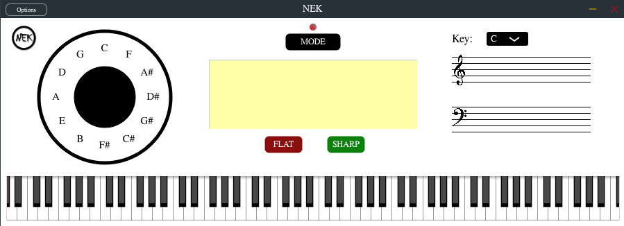

# NEK - A MIDI Chord Analyzer Plugin
NEK is an open source MIDI chord analyzer plugin. It takes in MIDI notes and outputs a chord name. The algorithm has a database for intervals and what intervals make up the chords. By projecting notes into different pitch classes, it uses anelegant but subtle algorithm to deduce the note and get the appropriate chord. This is all the more remarkable as the database is extensible. Put in the intervals that make up your chord and you are good to go! 

## TODO
---
```
- Note Rendering Capabilities
- Circle of Fifths Visualizer
- Automated Chord Detection using Deep Learning & Chromograms
```
---
